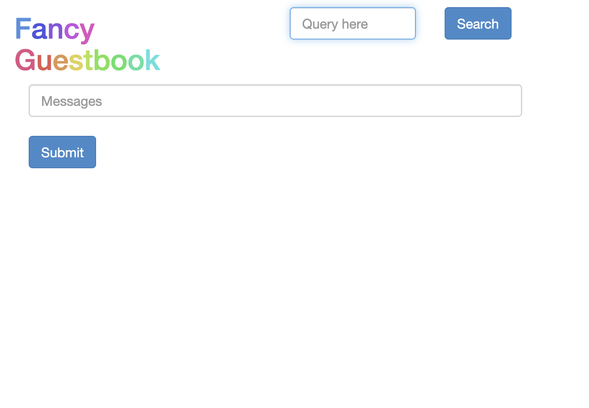

# ArgoCD setup 

## Prerequisites
- kubectl - install it to work with kubernetes cluster
- eksctl - for create EKS cluster in AWS
- AWS CLI - for working with AWS services

## Requirements
- 1 hub cluster where ArgoCD will be installed 
- 2 Spoke cluster where our application is deployed using kubernetes


## EKS Setup
```
eksctl create cluster --name hub-cluster --region us-east-2

eksctl create cluster --name spoke-cluster-1 --region us-east-2

eksctl create cluster --name spoke-cluster-2 --region us-east-2
```


### Install ArgoCD on hub cluster

```
kubectl config get-contexts

kubectl config use-context context-name 

kubectl config current-context
```

```
kubectl create namespace argocd

kubectl apply -n argocd -f https://raw.githubusercontent.com/argoproj/argo-cd/stable/manifests/install.yaml
```
Now that we have install ArgoCD

I have changed service type from ClusterIP to NodePort

```
get svc argocd-server -n argocd
```

Once that is done. Check the Port of the NodePort, go the AWS EC2(hub instance), check the security group and add the port number to inbound rules.
Lets Login to the ArgoCD UI
```
http://public-ip:port
```
Username is `admin` and We can get the admin password

```
 kubectl edit secrets argocd-initial-admin-secret -n argocd
```
Copy the password and decode it

```
echo `echo encode-base64-password== | base64 --decode`
```
Now that you have successfully logged in

### Lets add clusters to the argoCD

Currently we cannot add cluster to ArgoCD from UI. For that we need ArgoCD CLI

```
brew install argocd
```

other OS installation [[guide](https://argo-cd.readthedocs.io/en/stable/cli_installation/)]

Before adding cluster we need to login we same username and password
```
argocd login ip-address:port
```
Now that we have successfully logged into ArgoCD, lets add our clusters

```
argocd cluster add spoke-cluster-1 ip-address:port

argocd cluster add spoke-cluster-2 ip-address:port
```
Switch the context to spoke cluster, you will find the external url in service

```
kubectl get service
```




## Enable https ArgoCD 

Install IAM Policy for AWS Load Balancer Controller

```
curl -O https://raw.githubusercontent.com/kubernetes-sigs/aws-load-balancer-controller/v2.11.0/docs/install/iam_policy.json

aws iam create-policy \
--policy-name AWSLoadBalancerControllerIAMPolicy \
--policy-document file://iam_policy.json

eksctl utils associate-iam-oidc-provider --region=us-east-2 --cluster=hub-cluster --approve

```
Create an IAM Role and Service Account

```
eksctl create iamserviceaccount \
--cluster=hub-cluster \
--namespace=kube-system \
--region=us-east-2 \
--name=aws-load-balancer-controller \
--attach-policy-arn=arn:aws:iam::$(aws sts get-caller-identity --query Account --output text):policy/AWSLoadBalancerControllerIAMPolicy \
--override-existing-serviceaccounts \
--approve

```
Install AWS Load Balancer Controller using Helm

```
helm repo add eks https://aws.github.io/eks-charts
helm repo update

helm install aws-load-balancer-controller eks/aws-load-balancer-controller \
-n kube-system \
--set clusterName=hub-cluster \
--set serviceAccount.create=false \
--set serviceAccount.name=aws-load-balancer-controller

```

Update ArgoCD Service to Use LoadBalancer


```sh
kubectl edit svc argocd-server -n argocd
```

Modify the service type from `NodePort` to `LoadBalancer`
```yaml
spec:
  type: LoadBalancer
```

Get the new external URL for ArgoCD
```sh
kubectl get svc argocd-server -n argocd
```

### Don't forget to delete the clusters
```
eksctl delete cluster --name hub-cluster --region us-east-2

eksctl delete cluster --name spoke-cluster-1 --region us-east-2

eksctl delete cluster --name spoke-cluster-2 --region us-east-2

```
